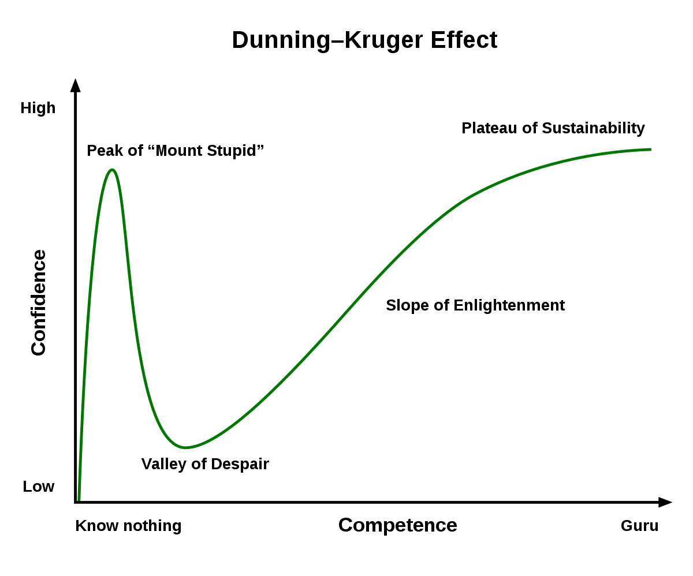
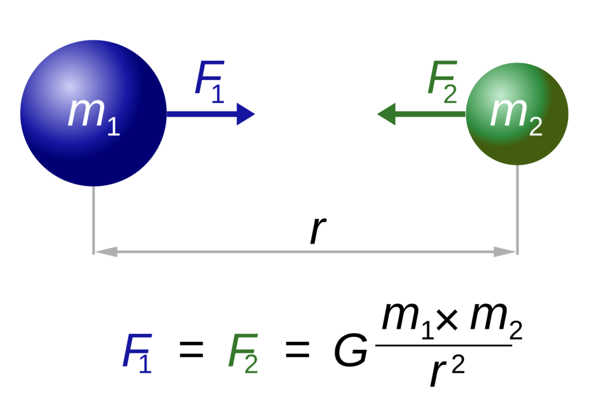
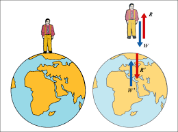
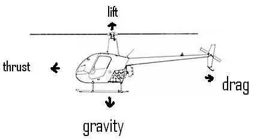

It's about time I finally joined the Flat Earth Gang, as an anonymous Twitter user TheCrytoElf has shown me the way. 

Just kidding. I'm here to address a common argument flat-Earther's make. Fans of mine would scream that addressing this topic is beneath me, but my fatass is here to stamp my foot on the ground and show that the explanation I have for you today is not trivial and counter-intuitive. Somehow, I'm here to defend the flat-Earthers, to tell my non-existent audience that there are a lot of things we take for granted. I'll probably end this discussion with some philosophical nonsense about ego or something to make myself seem smart. 

*Stop stalling, asshole*. Okay, let's begin. 



TheCrytoElf brings up a pretty interesting point. What does he mean when he says "\[p\]ut a helicopter in air just in one place and it should be somewhere else in a few hours"? Assuming he still has some braincells left, we'll assume he means that if you just vertically lifted a helicopter to...say 1000 feet in the air--and the Earth is actually a rotating ball of mass underneath--the ground should move significant distances over time, such taht when the helicopter lands again, it will be in a completely different location. At first, this seems to make some sense...I mean why the heck would a flying object rotate with the ground? And also, how do we not feel the Earth rotating at all?

Well, you probably got your answer to this in your first physics class (if you're Asian, 3 years old when you were at Kumon. High school, if you're some other race). But, let's do some physics review. How fast does the surface move on a spherical object as big as the Earth? Well, let's buy the spherical Earth theory for a bit, as hard as it might be for you. The Earth has a "measured" radius of approximately 6,400km. It does one rotation (360 degrees) in one day. How fast is the surface moving? Using some simple math from Kumon, we know that the formula for surface speed is:

$$s = r\omega$$

For the simpletons, I will explain these complicated letters. \\(s\\) is the tangential speed, \\(r\\) is the radius of the Earth, and \\(\omega\\) is the angular speed. Angular speed?!! Tangential? What black magic. Allow me to explain. The tangential speed is simply the speed at the Earth's surface. You would imagine it depends on how big something is (the radius) and how fast that thing is spinning (angular velocity). Let's calculate. 

$$s = (6400\text{km})\cdot(360\text{deg}/1\text{day})$$

With some quick maths (also considering 360 degrees is \\(2\pi\\) radians, please just google this at this point), we get this speed to be around 1,000mph. That's pretty fast! So a helicopter flying vertically overhead for just one hour could get you from NYC to Florida. What an efficient mode of travel! Also, this clearly isn't true, which means the Earth is flat! 

## Dunning-Kruger Effect in Full Force
Fortunately, a lot of the enlightened spherical-Earthers came to sanity's defense. With marvellous tweets like this one:


This was the default response to the brilliant TheCrytoElf. Clearly, he forgot that gravity exists, the wonderful "force" (or maybe travelling straight lines through curved spacetime?!) that keeps our feet on this beautiful Earth. Let's marvel at another "gotcha" tweet:



What a sick burn! Clearly, TheCryptoElf never learned about Newton's simple gravitation laws in school! Pathetic! So funny, how TheCryptoElf is clearly on the peak of Mount Stupid, while jetstothewest and actgeot are on the Plateau of Enlightenment! Or...are they?

Unfortunately, the jesters replying with quips about how TheCryptoKing doesn't understand gravity are also riding the tops of Mount Stupid, because shouting "gravity" doesn't explain this helicopter bullshit either. Knowing that Newton's Theory of Graviation is good for most purposes, let's analyze that model a little bit to see why it doesn't help explain the helicopters. 

## Thank the Apple, Newton

Newton provided us with a convenient equation that gives us the gravitational force exerted by any object that has mass (colloquially, "weight"). The more "massive" something is, the more the force. The Earth, being much more massive than every human on Earth except you...has a much stronger field, which is why it seems like you're attracted to the Earth and not the other way around. However, the Earth is attracted to you, but the value is so small that you can practically ignore it. Let's calculate: with G (gravitational constant) being measured to be approximately \\(6.67 \times 10^{-11}\\) and plugging some numbers online (if you believe them), the acceleration it exerts on you near the surface is around 9.8 meters per second per second, or 32 feet per second per second in freedom units. On the otherhand, an average adult male has a mass of 90 kilos with an exerts a gravitational acceleration on Earth of about \\(1.465 \times 10^{-22}\\) meters per second per second. To imagine how small this is, if you accelerated this much driving your car, it would take 370,000 years to drive 10km (6 miles) to go to the grocery store. 

Ok, it would have to make sense that the Earth pulls you much more than you pull it. So, why bring this up? The more important thing about this model of gravity is the direction in which gravity pulling you. 

Through some clever symmetry analysis or some 3d force calculations (probably with calculus), you can show that the force on your body from Earth points to the center of the Earth. This would have to be right, otherwise we would not be able to stand on the ground. That force is what keeps us from joining the Russians at the ISS. The ground exerts a force on your body, essentially canceling out the force of gravity so you don't just fall through the Earth (i.e. the normal force), which disappears everytime you jump up from the ground (until you land back on it).

A helicopter floating in mid-air has rotors that provide lift that counteracts the gravitational force, allowing it to "float" in midair. Its "normal" force is the lift, although it must have had more lift (upward acceleration) than gravity in order to fly up into the air, until it became stationary (relative to the earth, i.e. floating).

Yeah, so...if gravity just keeps your feet on the ground or keeps your helicopter from floating into space...that doesn't really explain why the ground doesn't just rotate beneath the helicopter. Even more, it doesn't explain why your body stays on the ground either. Why isn't the ground rotating under your feet? Friction? I don't think friction is the force spinning you 1000mph because your shoes would have to be made of the hardest material the Universe can conjure. 

Yeah, so gravity doesn't explain this at all. The people who thought themselves superior to TheCryptoKing should sit down. Just because you're right about a spherical Earth doesn't mean you can explain it, either. Sometimes, not everything can be explained away so simply. 

## The Real Explanation